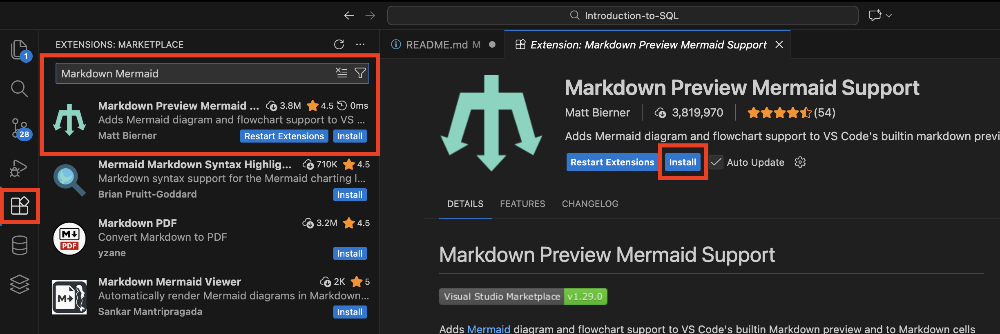
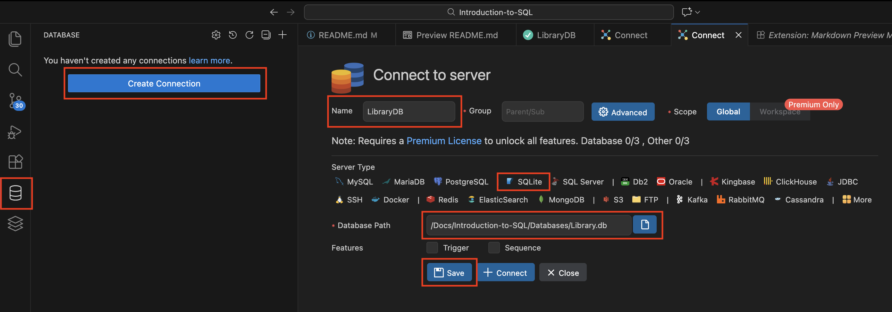
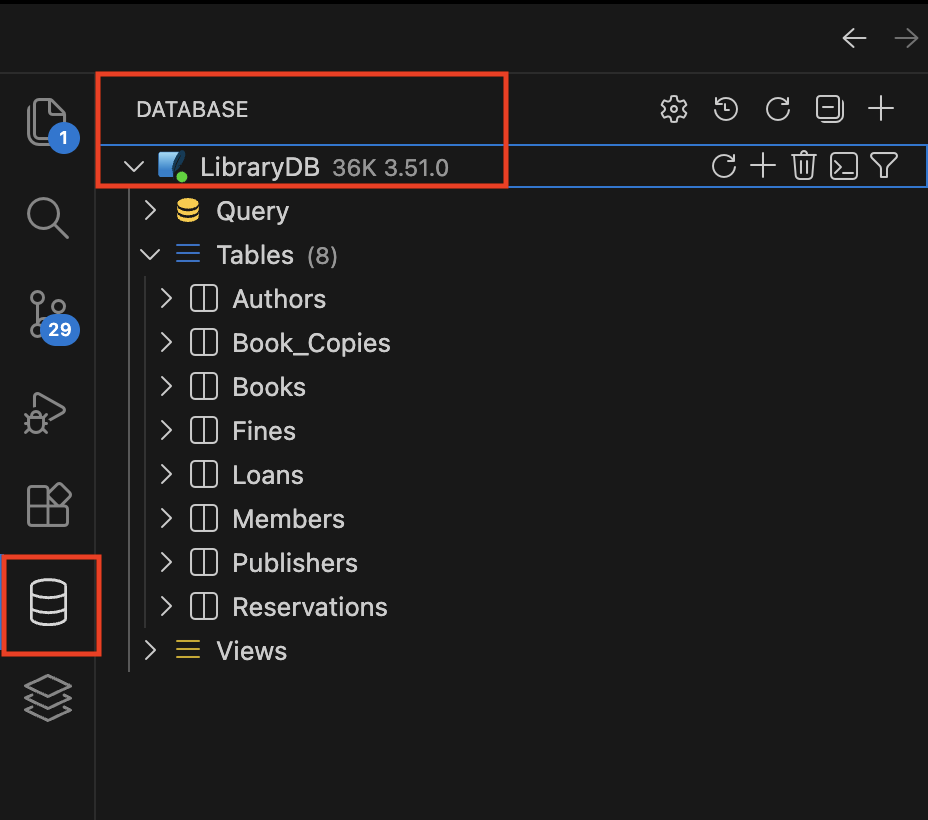

# SQL Learning Path – Library Database

Welcome! This repo is a hands-on, beginner-first path for learning SQL using a realistic Library database. Follow the numbered lessons in order, run one query at a time, and check the answers only after you try the exercises yourself.

---

## Prerequisites (install these first)
- SQLite (CLI)
- VS Code
- VS Code extensions: Database Client JDBC, Markdown Preview Mermaid Support

---

## Quick start (fastest path)
1) Clone/download this repo.  
2) Open it in VS Code.  
3) Use the Database Client JDBC extension to open `Databases/Library.db` (or the SQLite CLI: `sqlite3 Databases/Library.db`).  
4) Start with `Exercises/01 - SELECT Basics/01 - SELECT Basics.sql`.  
5) Run the example queries, then attempt the exercises at the bottom.  
6) Open the matching `- ANSWERS.sql` only to check your work.  

Tip: run one query at a time so you can see exactly what changes.








---

## Project layout
- `Databases/Library.db` — ready-to-query SQLite database (sample data included)
- `Databases/Database Scripts/LibraryDB/schema.sql` — schema
- `Databases/Database Scripts/LibraryDB/sample dataset.sql` — data seed
- `Exercises/<lesson>` — teaching file + `- ANSWERS.sql`

Lessons are numbered; do them in order.

---

## Resetting the database (optional)
If you want to recreate the DB from scratch:
```bash
cd /Users/ryan/Desktop/Databases
sqlite3 Databases/Library.db < "Databases/Database Scripts/LibraryDB/schema.sql"
sqlite3 Databases/Library.db < "Databases/Database Scripts/LibraryDB/sample dataset.sql"
```

---

## ERD (Entity Relationship Diagram)

The following diagram shows the structure of the database.

```mermaid
erDiagram
    Publishers ||--o{ Books : publishes
    Authors    ||--o{ Books : writes
    Books      ||--o{ Book_Copies : has
    Members    ||--o{ Loans : makes
    Book_Copies ||--o{ Loans : loaned_as
    Members    ||--o{ Reservations : makes
    Books      ||--o{ Reservations : reserved_for
    Loans      ||--o{ Fines : incurs

    Publishers {
        int publisher_id PK
        text name
        text country
    }

    Authors {
        int author_id PK
        text full_name
    }

    Books {
        int book_id PK
        int publisher_id FK
        int author_id FK
        text title
        text isbn
    }

    Book_Copies {
        int copy_id PK
        int book_id FK
        text status
        text shelf_location
    }

    Members {
        int member_id PK
        text full_name
        text email
    }

    Loans {
        int loan_id PK
        int member_id FK
        int copy_id FK
        text loan_date
        text due_date
        text return_date
    }

    Reservations {
        int reservation_id PK
        int member_id FK
        int book_id FK
        text reserved_date
    }

    Fines {
        int fine_id PK
        int loan_id FK
        real amount
        int paid
    }
