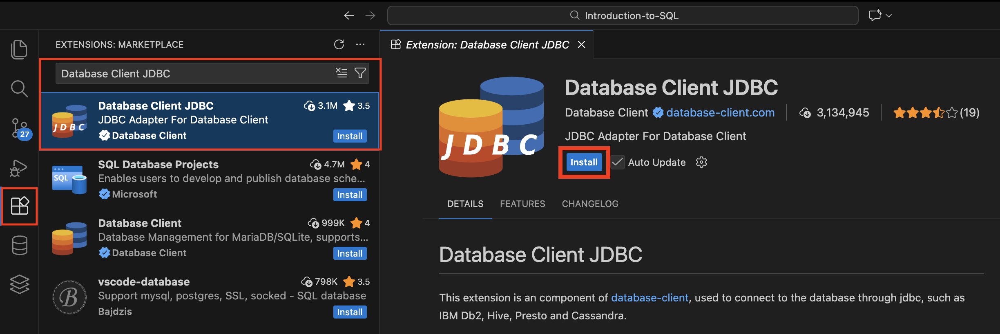
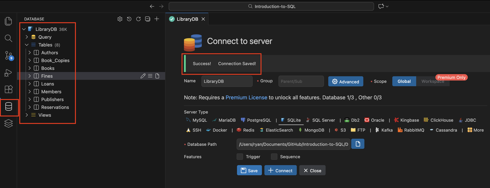
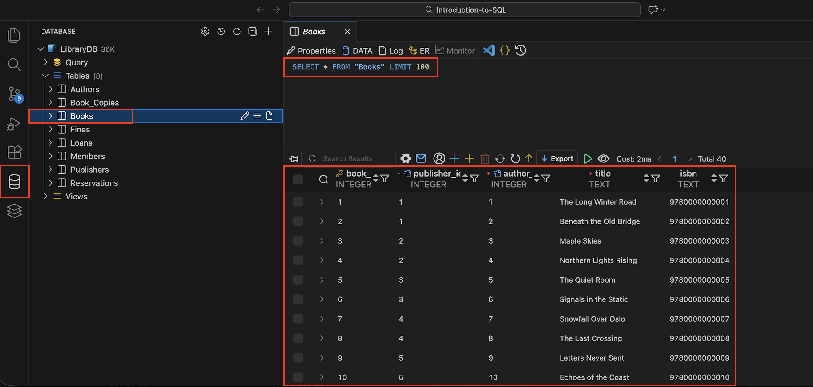
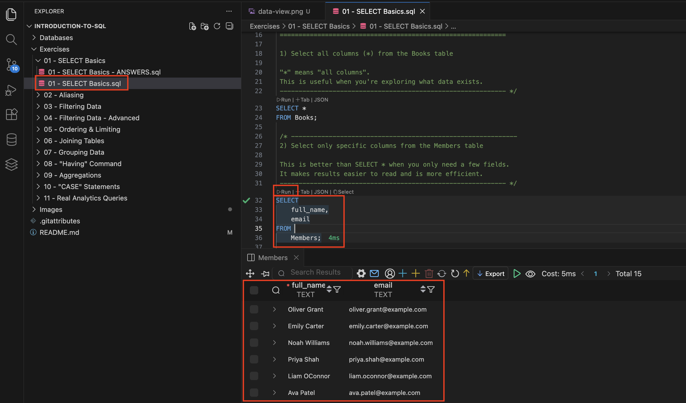
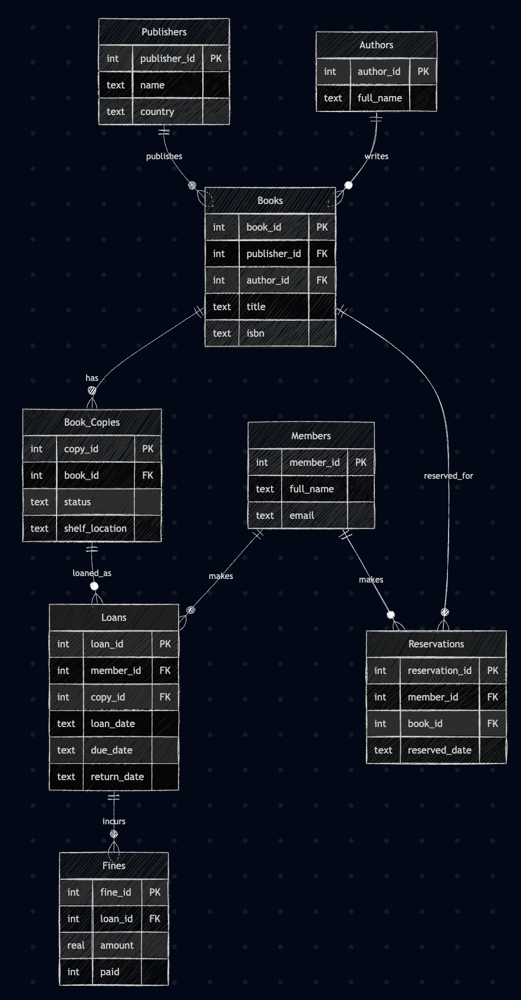

# SQL Learning Path – Library Database

Welcome! This repo is a hands-on, beginner-friendly path for learning SQL using a realistic Library database. The steps below guide you from installing the tools to running each exercise in order.

---

## Install the required tools
- **VS Code** (free code editor) — download and install from https://code.visualstudio.com/.
- **SQLite** (database engine) — On macOS you likely already have it. If it’s missing, install via https://sqlite.org/download.html or run `brew install sqlite` in the terminal.
- **VS Code extensions**
  - **[Required]** _Database Client JDBC_ (lets you connect to the included SQLite file).

---

## Open the project
1) Clone or download this repo.  
2) In VS Code, choose “File → Open Folder” and select the project folder (Introduction-To-SQL).  
3) Keep the `Databases/Library.db` file where it is—this is the database you will query.

---

## Connect to the Library database in VS Code
1) Open the **Database Client JDBC** extension panel in VS Code. (The icon highlighted in red, on the left of the image) 
2) Add a **SQLite** connection.  
3) When prompted for the database file, browse to `Databases/Library.db` in this repo and connect.  
4) You should now see the Library database listed in the extension panel.

5) When connected, you should see the following:

6) If you select a table, it will run a SQL query to retrieve the first 100 rows, and display the data

---

## Work through the exercises (step-by-step)
1) Open `Exercises/01 - SELECT Basics/01 - SELECT Basics.sql` (the teaching file—**not** the `- ANSWERS` file).  
2) In the editor, place your cursor in the first SQL statement and click the **Run** button shown above it (or the play icon in the gutter).  
3) A results grid will appear; review it to make sure it matches what the query is supposed to do.  

4) Continue running each statement in order.  
5) When you reach the exercises section in that file, write your answers directly below each prompt and run them the same way.  
6) After you try the exercises yourself, open the matching `*- ANSWERS.sql` file to compare results.  
7) Move to the next numbered lesson folder and repeat the same pattern.

Tip: run one query at a time so it’s clear what each statement returns or changes.

---

## ERD (Entity Relationship Diagram)

The diagram below shows the Library database structure.

